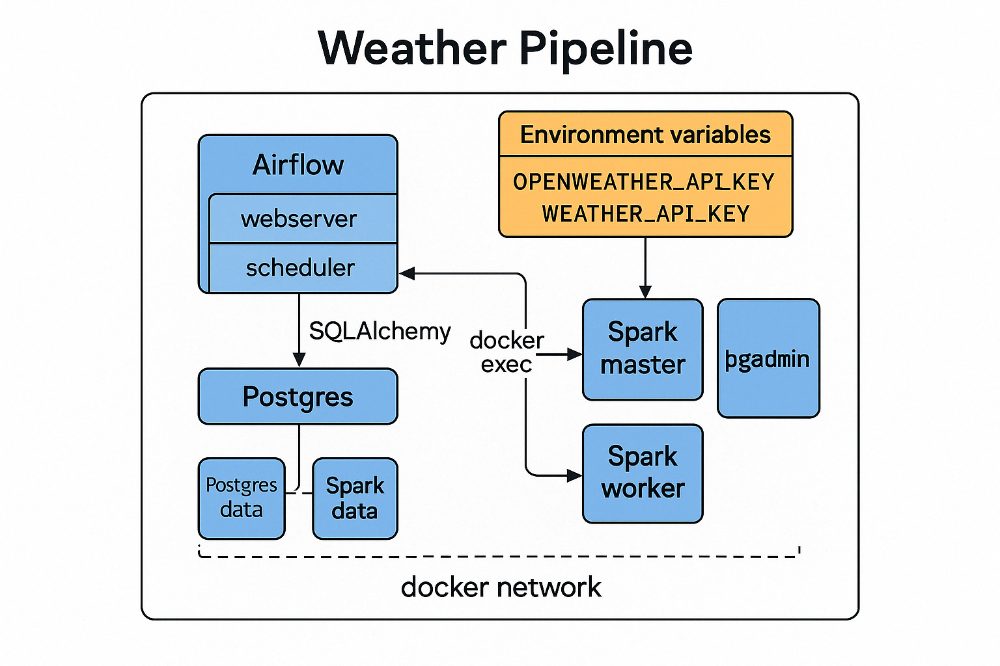

# Weather Data Pipeline Project  
<sub>Apache Airflow • Apache Spark • PostgreSQL • Docker Compose</sub>



---

## 🎯 Amaç
OpenWeather API’sinden saatlik hava durumu verilerini çekip:
1. Spark üzerinde işleyerek dönüştürmek,
2. PostgreSQL veritabanına yüklemek,
3. Tüm süreci Airflow DAG’ıyla orkestre etmek.

Projeyi **Docker Compose** ile tek komutla ayağa kaldırabilir; Portainer & pgAdmin ile yönetebilirsiniz.

---

## 📂 Dizin Yapısı
```
├── dags/                     # Airflow DAG dosyaları
│   └── weather_etl.py
├── spark-app/                # Spark uygulaması & submit script
│   ├── weather_transform.py
│   └── weather-submit
├── postgres/
│   └── init.sql              # Başlangıç şeması & tablo oluşturma
├── diagrams/
│   └── weather-pipeline.png  # Mimari diyagram
├── Dockerfile                # Airflow image’i için
├── docker-compose.yaml       # Tüm servis tanımları
└── README.md
```

---

## 🚀 Hızlı Başlangıç
```bash
# 1) Projeyi klonla & klasöre gir
$ git clone https://github.com/eqselans/weather-data-pipeline weather-pipeline && cd weather-pipeline

# 2) Ortam değişkenlerini ayarla
# .env içinde WEATHER_API_KEY vb. değerleri doldur

# 3) Servisleri başlat
$ docker compose up -d --build

# 4) Airflow UI (localhost:8080) -> admin / admin
#    Portainer   (localhost:9000)
#    pgAdmin     (localhost:5050) -> pgadmin@example.com / admin

# 5) Airflow Scheduler servisini başlat
$ airflow scheduler 
```

### Servis Portları
| Servis | Port |
|--------|------|
| Airflow Web UI | **8080** |
| Spark Master UI | **8088** |
| Spark Worker UI | **8089** |
| PostgreSQL | **5432** |
| pgAdmin | **5050** |
| Portainer | **9000** |

---

## ⚙️ Airflow
* **Executor:** `LocalExecutor`
* **Değişkenler:**
  * `OPENWEATHER_API_KEY` – UI > Admin > Variables veya `scripts/load_airflow_vars.py` ile CLI’dan yükleyin.
* **DAG:** `weather_api_spark_etl`
  * `BashOperator` → `spark-master` container’ında `weather-submit.sh` çağrılır
  * Başarısız olursa otomatik yeniden dener; loglar `./logs` volume’unda saklanır

---

## 🔥 Spark Uygulaması
* `weather_transform.py` → JSON verilerini DataFrame’e çevirir, kolon tiplerini dönüştürür, timestamp ekler.
* `spark-submit` parametreleri `weather-submit` içinde tanımlı:
  * `--master spark://spark-master:7077`
  * Maven paketi: `org.postgresql:postgresql:42.7.3`
* Ortam değişkeni `WEATHER_API_KEY` Spark driver’a `docker exec -e` ile iletilir.

---

## 🐘 PostgreSQL
Başlangıç tablosu **`weather_data`**
```sql
CREATE TABLE IF NOT EXISTS weather_data (
  city         TEXT,
  condition    TEXT,
  temperature  DOUBLE PRECISION,
  humidity     INTEGER,
  pressure     INTEGER,
  timestamp    TIMESTAMP
);
```
pgAdmin ile tabloyu görüntüleyebilir veya sorgulayabilirsiniz.

---

## 🛠️ Geliştirme
* **Python 3.9**  
  - Kod stili : `black`, `isort`, `flake8` → `pre-commit` hook’ları hazır.
* **Conventional Commits** kullanın (örn. `feat:`, `fix:`, `docs:`).  
* Yeni bir özellik için `feature/<isim>` dalı açın, PR ile birleştirin.

---

## 📋 Sık Kullanılan Komutlar
| İşlem | Komut |
|-------|-------|
| Tüm servisleri durdur | `docker compose stop` |
| Yeniden başlat | `docker compose start` |
| Logları takip | `docker compose logs -f airflow` |
| Airflow scheduler shell | `docker compose exec airflow airflow scheduler` |
| Spark shell | `docker compose exec spark-master spark-shell` |

> **Duraklat/Devam (Stop/Start) Notu**  
> Volume’ler kalıcı olduğu için konteynerleri kapatıp ( `docker compose stop` ) uzun süre sonra `start` yaptığınızda veritabanı ve Airflow metadatası korunur. Yalnızca versiyon güncellemesi yapacaksanız `docker compose pull` + `up -d --build` öncesinde `db upgrade` komutu çalıştırmanız yeterlidir.

---

## 📝 Lisans
MIT Lisansı © 2025 Your Name

